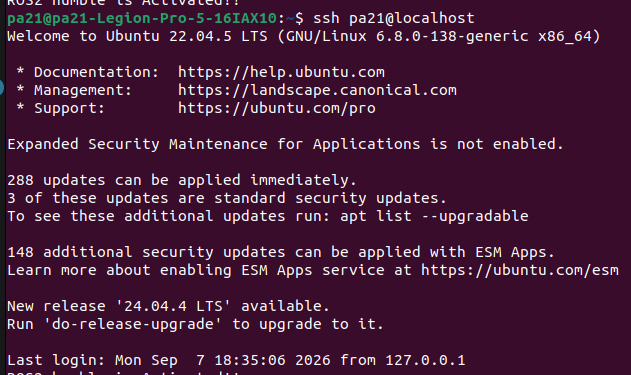
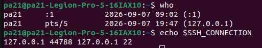
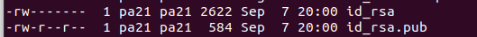
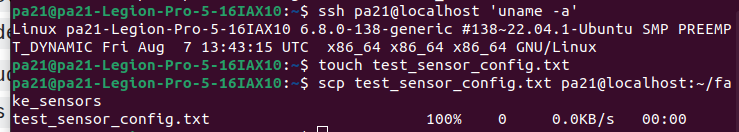
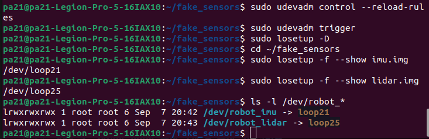

## 문제 1: 배달 로봇 임베디드 및 Edge AI 시스템 설계

[작성 가이드 및 핵심 요약]
- 임베디드: 초고속 반응속도(하드 실시간)가 필수인 모터 제어
- Edge AI: 로봇 내부의 온보드 AI 컴퓨터. 고용량 비전 데이터(카메라) 및 복잡한 판단 연산 수행
- 클라우드: 실시간 제어와 무관하며 데이터 저장이 목적인 비실시간 작업


### 1. 연산 분담 배치표
 각 작업의 연산 위치는 지연 예산(Latency Budget)과 데이터 전송량, 그리고 안전성(Hard Real-time) 요구사항에 따라 결정되었습니다. 

 2D 라이다(10Hz)      -> 100ms <br>
 바퀴 엔코더(1kHz)     -> 1ms   <br>
 모터 드라이버  <br>
 RGB 카메라(30fps·1080p) -> 33ms <br>
 LTE 모듈. 보통 

---

| 작업 | 위치 | 지연예산 | 데이터량 | 근거 |
| :--- | :--- | :--- | :--- | :--- |
| **모터 속도 제어** | 임베디드 | < 1ms | 매우 적음 (<1KB/s) | 충돌 및 추락 등 물리적 사고 방지를 위해 지연이 없는 초고속 즉각 제어가 필수임 |
| **장애물 감지** | 임베디드 / Edge AI | < 50ms | 적음 (~수십KB/s) | 라이다 스캔 데이터(14.4KB/s)를 바탕으로 급정거 반응 시간을 확보해야함|
| **보행자 인식** | Edge AI | < 100ms | 매우 큼(186.6 MB/s) | 1080p 30fps 원시 영상은 즉각반응할 필요는 없으나 클라우드 전송하기에는 초당 크기가 거의 30배 달하기에 LTE 전송이 불가능함 따라서 온보드 AI 컴퓨터(Edge)에서 처리해야 함 |
| **지도 기반 경로 계획** | Edge AI | < 1s | 보통(지도 및 위치 정보) | 인지된 주변 환경을 바탕으로 목적지까지의 최적 경로를 주기에 맞춰 안전하게 재계산함 |
| **배달 완료 사진 업로드** | 클라우드 | < 5s | 보통(사진 1장, 수MB) | 압축 사진(2~5MB) 1장을 서버로 전송하는 작업으로, 사용자 UX 상한선 5s 적용 |
| **운행 로그 집계** | 클라우드 | < 수 분~수 시간 | 보통 (텍스트 로그) | 사후 상태 분석용 데이터로 실시간 제어와 무관하여 저속 전송 허용 |

---

### 2. 카메라 원시 영상 전송량 및 LTE 대역폭 판단

* **카메라 원시 영상 전송량:** **186.62 MB/s**
    * *산출과정:* $1920 \times 1080 \text{ (해상도)} \times 3 \text{ Byte (RGB)} \times 30 \text{ fps (프레임)} = 186,624,000 \text{ Byte/s} \approx 186.62 \text{ MB/s}$
* **LTE 대비 판단:** **불가능 (아키텍처 성립 불가)**
    * *근거:* 일반적인 LTE 업로드 실효 대역폭은 초당 약 **2.5MB/s ~ 6.25MB/s** (20~50Mbps) 수준입니다. 카메라에서 발생하는 원시 전송량(186.62 MB/s)은 LTE 한계 용량보다 **약 30배 이상 크므로**, 원시 영상을 클라우드로 전송하는 시스템 설계는 물리적으로 불가능합니다.
---

### 3. 인지·판단·제어 계층 매핑과 주기표
| 계층 | 작업 | 관련 센서 / 장치 | 갱신 주기 (Frequency) | 비고 |
| :--- | :--- | :--- | :--- | :--- |
| **제어 (Control)** | 모터 속도 제어 | 바퀴 엔코더(1kHz), IMU(200Hz), 모터 드라이버 | **1kHz (1,000Hz)** | 최단 주기 (0.001초 간격) |
| **인지 (Perception)** | 장애물 감지, 보행자 인식 | 2D 라이다(10Hz), RGB 카메라(30fps) | **10Hz ~ 30Hz** | 실시간 감지 (0.03~0.1초 간격) |
| **판단 (Decision)** | 지도 기반 경로 계획 | 센서 융합 데이터 및 지도 | **1Hz ~ 10Hz** | 상위 판단 (0.1~1초 간격) |
| *(비실시간 서비스)* | 배달 완료 사진 업로드, 운행 로그 집계 | LTE 모듈 | **비주기적 (Event-driven)** | 이벤트 발생 시 전송 |

---

### 4. Hard / Firm / Soft 실시간 분류표

| 구분 | 작업 | 마감 초과(Deadline Miss) 시 물리적 결과 |
| :--- | :--- | :--- |
| **Hard** | **모터 속도 제어** | 제어 타이밍을 놓쳐 로봇이 보행자/벽과 물리적으로 충돌하거나 낭떠러지로 추락하는 등 치명적인 물리적 사고가 발생함 |
| **Firm** | 장애물 감지, 보행자 인식 | 마감 시간을 넘긴 데이터는 가치를 잃어 버려지며, 최신 상황을 인지하지 못해 적절한 판단을 내릴 수 없음 |
| **Soft** | 지도 기반 경로 계획, 사진 업로드, 운행 로그 집계 | 처리 반응이 답답해지거나 서비스 전송이 약간 늦어질 뿐, 로봇의 안전 동작에는 아무런 위험이 생기지 않음 |

---

### 5. 주기 · 지연 · 지터 구분

* **주기 (Period):** 바퀴 엔코더가 바퀴 회전수를 정확히 측정한 후 제어기에 전달하기 위해 1kHz 속도로 0.001초마다 정기적으로 수행하는 반복 시간 간격이다.
* **지연 (Latency):** 라이다 센서가 장애물을 감지한 입력을 받은 순간부터 모터 드라이버에 정지 신호가 전달되어 로봇이 실제로 멈추는 출력이 나올 때까지 걸린 총 소요 시간이다.
* **지터 (Jitter):** 카메라 영상 데이터가 Edge AI로 전달되는 시간 간격이 시스템 부하로 인해 0.03초, 0.05초 등 일정하지 않고 불규칙하게 오르내리는 시간 오차 및 변동 폭이다.

---

## 2. 원격 접속(SSH)과 센서 장치 경로 고정

### 1. SSH 서버 구성 및 접속 환경
- **고른 접속 대상:** localhost (동일 우분투 환경 내 원격 접속 모사)
`ssh pa21@localhost`

#### 1) SSH 서버 설치 및 22번 포트 활성화 확인
SSH 데몬(`openssh-server`)을 설치하고 22번 포트가 정상적으로 열려 listening 상태인지 확인 
 `sudo apt install openssh-server`
```bash
    LISTEN 0      128          0.0.0.0:22         0.0.0.0:*                                   
    LISTEN 0      128             [::]:22            [::]:*  
```


`who` , `echo $SSH_CONNECTION`



### 2. 개인키·공개키 중 서버에 등록하는 것: 공개키 (id_rsa.pub)


```text
안전한 이유: 공개키는 데이터를 암호화하거나 서명을 검증하는 용도로만 쓰여 외부에 공개되어도 안전하며, 암호화된 데이터를 푸는 핵심인 개인키(id_rsa)는 접속을 시도하는 클라이언트 컴퓨터에만 비밀로 보관되기 때문.

ssh-keygen을 치면 일어나는 일
컴퓨터가 아주 복잡한 수학 공식으로 세트 열쇠 2개를 뚝딱 만듭니다.
내 컴퓨터의 ~/.ssh/ 라는 비밀 폴더 안에 두 파일을 저장합니다.
id_rsa (개인키 - 내 주머니용)
id_rsa.pub (공개키 - 서버 전달용)
```
---
### 3.원격 단일 명령 실행과 scp 전송 출력

- 원격 단일 명령 실행 : `ssh pa21@localhost 'uname -a'`
- scp 파일 전송 테스트 : `touch test_sensor_config.txt` , <br>
`scp test_sensor_config.txt pa21@localhost:~/fake_sensors`



---
### 4. 두 장치를 구분한 속성:
 - 라이다 : /dev/loop21 <br>
- IMU  : /dev/loop25

1) 시리얼 장치 파일 확인 (/dev/tty*)
```bash
$ ls -l /dev/tty*
crw-rw---- 1 root dialout 188, 0 Sep  7 10:00 /dev/ttyUSB0
crw-rw-rw- 1 root tty       5, 0 Sep  7 10:00 /dev/tty
```
2) loop 장치를 이용한 가상 라이다 / IMU 센서 생성
```bash
# 라이다 · IMU 역할을 할 가상 장치 두 개 붙이기 — USB 하드웨어 없이 진행합니다
mkdir -p ~/fake_sensors && cd ~/fake_sensors
truncate -s 16M lidar.img
truncate -s 24M imu.img          # 크기를 다르게 두면 구분 속성이 하나 더 생깁니다
sudo losetup -f --show lidar.img   # 예: /dev/loop21
sudo losetup -f --show imu.img     # 예: /dev/loop25

# 만약 해제 하고싶다면?
sudo losetup -d /dev/loop0 /dev/loop1
```
---

### 5. 작성한 udev 규칙 2개 + 규칙 키 설명표
```ini
# 파일 수정
sudo nano /etc/udev/rules.d/99-robot-sensor.rules
#수정내용
KERNEL=="loop*", ATTR{size}=="32768", SYMLINK+="robot_lidar"
KERNEL=="loop*", ATTR{size}=="49152", SYMLINK+="robot_imu"
#규칙 재적용
sudo udevadm control --reload-rules
sudo udevadm trigger
```

**[udev 규칙 키(Key) 및 연산자 역할 정리]**
| 키 (Key) | 사용 연산자 | 연산자 구분 | 역할 및 설명 |
| :--- | :---: | :---: | :--- |
| **`KERNEL`** | `==` | 비교 연산자 | 커널이 장치에 부여한 기본 장치 이름 패턴(예: `loop*`, `ttyUSB*`)이 일치하는지 검사합니다. |
| **`ATTR{size}`** | `==` | 비교 연산자 | sysfs 경로에 등록된 장치의 속성 중 **섹터 단위 크기**를 비교합니다.<br>• `32768`: 16MB ($32768 \times 512\text{ Byte}$) $\rightarrow$ 라이다(LiDAR)<br>• `49152`: 24MB ($49152 \times 512\text{ Byte}$) $\rightarrow$ IMU |
| **`SYMLINK`** | `+=` | 추가 연산자 | 조건이 완전히 일치할 때 `/dev/` 디렉토리 하위에 새로운 **심볼릭 링크(별칭)**를 지정 항목으로 추가합니다. |

 **[연산자 비교 정리]**
| 연산자 | 연산자 이름 | 기능 |
| :---: | :--- | :--- |
| **`==`** | 비교 (Equal) | 왼쪽 항목의 값과 오른쪽 조건이 동일한지 비교 검사합니다. |
| **`=`** | 대입 (Assign) | 해당 속성의 기존 값을 무시하고 새로운 값으로 덮어씁니다. |
| **`+=`** | 추가 (Add) | 기존에 설정된 값들의 리스트를 유지하면서 새로운 값을 추가합니다. |


### 6. 순서를 바꿔 재연결한 뒤 ls -l /dev/robot_* 결과
```bash
# 1. 기존 연결 모두 해제
sudo losetup -D

# 2. IMU(24M) 먼저 연결 (예: loop21으로 할당)
cd ~/fake_sensors
sudo losetup -f --show imu.img

# 3. 라이다(16M) 나중에 연결 (예: loop25로 할당)
sudo losetup -f --show lidar.img
```


---

### 7.실제 USB 센서용 규칙 초안과 구분 근거

가상 장치(`loop*`)가 아닌 **실제 물리 USB 센서**를 연결할 때는 장치의 **고유 식별 정보(하드웨어 ID)**를 사용하여 udev 규칙을 작성합니다.
```bash
#udev 규칙 초안
```ini
 # 실제 USB 장치 속성 확인 방법 (명령어)
 lsusb
 #특정 장치(/dev/ttyUSB0)의 udev 상세 속성 전체 출력
 udevadm info --name=/dev/ttyUSB0 --attribute-walk | grep -E "idVendor|idProduct|serial"

# 라이다 센서 (USB)
SUBSYSTEM=="tty", ATTRS{idVendor}=="10c4", ATTRS{idProduct}=="ea60", ATTRS{serial}=="0001", SYMLINK+="robot_lidar", MODE="0666"

# IMU 센서 (USB)
SUBSYSTEM=="tty", ATTRS{idVendor}=="0483", ATTRS{idProduct}=="5740", ATTRS{serial}=="0002", SYMLINK+="robot_imu", MODE="0666"
```

### 실제 USB 센서 구분 근거 표

| 구분 항목 | udev 속성 키 | 연산자 | 구분 근거 및 수집 방법 |
| :--- | :--- | :---: | :--- |
| **서브시스템** | `SUBSYSTEM` | `==` | 장치가 커널에 등록되는 분류군을 지정합니다.<br>• USB 시리얼 센서의 경우 보통 `tty` 또는 `ttyUSB`로 지정하여 무관한 블록 장치 등을 1차적으로 배제합니다. |
| **제조사 ID** | `ATTRS{idVendor}` | `==` | USB 컨트롤러 칩셋 제조사에 부여된 고유 4자리 16진수 코드입니다.<br>• 예: Silicon Labs (`10c4`), STMicroelectronics (`0483`) 등 브랜드 수준의 구분에 사용됩니다. |
| **제품 ID** | `ATTRS{idProduct}` | `==` | 해당 제조사에서 특정 제품 모델에 부여한 4자리 16진수 코드입니다.<br>• 동일 제조사의 서로 다른 센서 라인업(예: 라이다 vs IMU)을 2차적으로 식별합니다. |
| **시리얼 번호** | `ATTRS{serial}` | `==` | 공장에서 출하될 때 개별 장치마다 부여되는 **최종 고유 식별자**입니다.<br>• 제조사와 제품 모델이 완전히 동일한 센서를 2개 이상 연결하더라도 단일 장치를 정확히 특정할 수 있는 핵심 근거입니다. |

1. **USB 연결 확인:** `lsusb` 명령어로 연결된 센서의 Vendor ID와 Product ID 조합(`ID XXXX:YYYY`)을 확인합니다.
2. **세부 속성 추출:** `udevadm info --name=/dev/ttyUSB0 --attribute-walk` 명령을 통해 `idVendor`, `idProduct`, `serial` 속성을 상위 부모 노드에서 추출합니다.
3. **규칙 명세:** 추출한 3가지 속성을 조합하여 심볼릭 링크(`SYMLINK+="robot_lidar"`)를 생성하는 udev 규칙을 정의합니다.