# 과제 보고서


##문제1. C++ 빌드 체계 세우기— g++ 다중 파일 빌드와 CMake 전환

### 1. 수동 2단계 빌드 명령(터미널 입력)
``` bash
#1단계: 컴파일 (-c 옵션으로 각 .cpp를 .o 파일로 만듦)
g++ -Wall -std=c++17 -c motor.cpp main.cpp
#2단계: 링크 (.o 파일들을 묶어 실행파일 생성)
g++ motor.o main.o -o motor_app
```
cmake 증분빌드 방법-> 
build/ 생성 후 build/ 안에서 해당 내용 실행
make ..
make
./실행파일명


### 2. undefined reference 에러 메시지 (출력) — 컴파일 에러와의 차이 설명
* **motor.o 를 일부러 빼고 빌드** 
```text
/usr/bin/ld: main.o: in function `main':
main.cpp:(.text+0x24): undefined reference to `Motor::Motor()'
/usr/bin/ld: main.cpp:(.text+0x68): undefined reference to `Motor::setSpeed(double)'
/usr/bin/ld: main.cpp:(.text+0x90): undefined reference to `Motor::getSpeed() const'
collect2: error: ld returned 1 exit status
```
* **컴파일 에러와의 차이**
  * 컴파일 에러: 문법 오타나 세미콜론 누락 등으로 인해 .cpp코드를 기계어(.o)로 번역하는 단계에서 발생하는 오류입니다.
  * 링크 에러(undefined reference): 번역은 정상 수행되어 .o 부품은 생성되었으나, main.o가 호출하려는 실제 알맹이 코드(motor.o)를 연결(링크)하는 과정에서 부품이 빠져 발생한 오류입니다.

### 3. CMake 빌드 출력 (터미널 출력)
* mkdir build && cd build :빌드 중간 산출물(.o , Makefile 등)이 원본 코드 폴더를 더럽히지 않도록 전용 방을 만들고 들어갑니다.
* cmake .. : 상위폴더(..)의  CMakeLists.txt 를 읽어 해당 시스템에 맞는 조립 설명서(Makefile)을 만들어 냅니다.

```text
mkdir -p build
cd build
cmake ..
make

** 결과 **
[ 20%] Building CXX object CMakeFiles/stop_distance.dir/stop_distance.cpp.o
[ 40%] Linking CXX executable stop_distance
[ 40%] Built target stop_distance
[ 60%] Building CXX object CMakeFiles/motor_app.dir/motor.cpp.o
[ 80%] Building CXX object CMakeFiles/motor_app.dir/main.cpp.o
[100%] Linking CXX executable motor_app
[100%] Built target motor_app
```


### 4. 증분 빌드 시 재컴파일 된 파일 - 판단근거
 ::코드를 일부 고쳤을 때 전체를 다 새로 만들어야 하는지 확인합니다.

* **실험**
```text
touch ../motor.cpp
make

** 결과 **
Consolidate compiler generated dependencies of target stop_distance
[ 40%] Built target stop_distance
Consolidate compiler generated dependencies of target motor_app
[ 60%] Building CXX object CMakeFiles/motor_app.dir/motor.cpp.o
[ 80%] Linking CXX executable motor_app
[100%] Built target motor_app
```
* ** 판단 근거**
* main.cpp는 다시 컴파일 되지 않고 motor.cpp만 재컴파일 됨.
* 빌드도구(make)는 소스 파일 (.cpp)의 최종 수정시각(Timestamp)과 컴파일된 부품 파일(.o)의 생성 시각을 비교합니다. motor.cpp가 motor.o 보다 최신 시각을 가지면 해당 파일만 다시 컴파일하고, 변경되지 않은 main.cpp 는 기존의 main.o를 그대로 재사용하여 빌드 시간을 단축시킵니다.

---

##문제2. 현대 C++로 센서 계층 구현 — RAII·다형성·STL

### 1. 다형성 루프 출력
```text
===[관찰 2] 다형성 루프 실행 ===
[Main] LidarSensor 측정값: 0.25
[Main] ImuSensor 측정값: 0.8
```
### 2. 스택 객체와 힙 객체의 소멸 시점 — 관찰 로그와 설명
```text
===[관찰 1] 스택 객체 vs 힙 객체 소멸 시점===
---중괄호 범위 종료 전 ---
[Lidar] 자식 소멸자 실행: 힙_스마트포인터_라이다
[Sensor] 부모 소멸자 실행: 힙_스마트포인터_라이다메모리 해제됨
[Lidar] 자식 소멸자 실행: 스택_라이다
[Sensor] 부모 소멸자 실행: 스택_라이다메모리 해제됨
--- 중괄호 범위 종료 후 ---
```
* **설명**:
  * **소멸 순서**: 스택(Stack)의 후입선출(LIFO) 원리에 따라, 중괄호(`{ }`) 영역이 끝날 때 나중에 생성된 `heap_lidar` 스마트 포인터가 먼저 소멸하고, 이후 `stack_lidar`가 소멸합니다.
  * **메모리 해제 방식**:
  * **스택 객체**: 변수가 선언된 스코프(`{ }`)를 탈출할 때 C++ 런타임에 의해 자동으로 메모리가 해제됩니다.
  * **힙 객체**: 스마트 포인터(`unique_ptr`) 변수 자체가 스택에서 사라지는 순간, 자신이 가리키고 있던 힙 메모리의 객체를 자동으로 `delete` 처리합니다.

### 3. 가상 소멸자를 뺐을 때의 차이: ___
* **차이점**: 부모 클래스(`Sensor`) 소멸자에서 `virtual` 키워드를 제거하면, 부모 타입 포인터(`unique_ptr<Sensor>`)로 자식 객체를 해제할 때 **자식 소멸자(`~Lidar()`)가 호출되지 않고 부모 소멸자만 실행**됩니다.
* **소멸자 호출 순서 비교**:
* **`virtual` 적용 시**: `[Lidar] 자식 소멸자` → `[Sensor] 부모 소멸자` (정상 해제)
* **`virtual` 미적용 시**: `[Sensor] 부모 소멸자` 만 실행 (자식 객체가 점유한 동적 메모리가 해제되지 않아 **메모리 누수 발생**)


### 4. count_if 결과: 0.35 이내 기록 ___ 개
```text
===[관찰 3] STL 컨테이너 및 count_if 사용 예제 ===
0.35 m 이내인 기록 개수(장애물 감지 횟수): 4개(회)
```

### 5. 누수 검출 결과 → 수정 후 결과 (검출 도구 출력 비교)
* **가상 소멸자 미사용 시 (수정 전)**:
```text
==14776== HEAP SUMMARY:
==14776==     in use at exit: 1,600 bytes in 2 blocks
==14776==   total heap usage: 18 allocs, 16 frees, 76,684 bytes allocated
==14776== LEAK SUMMARY:
==14776==    definitely lost: 1,600 bytes in 2 blocks
==14776==    indirectly lost: 0 bytes in 0 blocks
==14776==      possibly lost: 0 bytes in 0 blocks
==14776==    still reachable: 0 bytes in 0 blocks
==14776==         suppressed: 0 bytes in 0 blocks
==14776== For lists of detected and suppressed errors, rerun with: -s
==14776== ERROR SUMMARY: 2 errors from 2 contexts (suppressed: 0 from 0)
```

* **가상 소멸자 적용 후 (수정 후)**:
```text
==14658== HEAP SUMMARY:
==14658==     in use at exit: 0 bytes in 0 blocks
==14658==   total heap usage: 18 allocs, 18 frees, 76,684 bytes allocated
==14658== All heap blocks were freed -- no leaks are possible
==14658== For lists of detected and suppressed errors, rerun with: -s
==14658== ERROR SUMMARY: 0 errors from 0 contexts (suppressed: 0 from 0)
```

---

##문제3. ROS 2 멀티노드 기반 turtlesim 자율 주행 및 제어 시스템 구현
-실행경로 :
 `cd ~/seunghye/physicalai-lv1-seunghye/lv1_module2/ros2_ws`
-turtle_py 빌드 :
 `colcon build --packages-select turtle_py --symlink-install`
- ROS2 공식 튜토리얼용 시뮬레이터를 화면에 띄우기:
 `ros2 run turtlesim turtlesim_node`
-빌드된 실행 파일들과 ROS 2 토픽 경로 정보를 현재 터미널 창의 환경 변수로 등록 :
 `source install/setup.bash`
-거리 계산 및 발행 노드 (distance_pub):
 `ros2 run turtle_py distance_pub`
-거리 감시 및 경고 노드 (distance_sub):
`ros2 run turtle_py distance_sub`
-정사각형 자율주행 노드 (square_driver):
`ros2 run turtle_py square_driver`

### 1. /turrle1/pose 필드 구성
`ros2 topic echo /turtle1/pose`실행 시 출력되는 필드 구성:
```text
---
x: 5.544444561004639  거북이의 X축 위치
y: 5.544444561004639  거북이의 Y축 위치
theta: 0.0            거북이의 바라보는 방향 (라디안)
linear_velocity: 0.0  선속도
angular_velocity: 0.0 각속도
---
```

### 2. ros2 topic hz /turtle_distance 출력
`ros2 topic hz/turtle_distance` 실행결과:
-**평균 발행 주기 (average rate):** 9.998 Hz (약 10.0 Hz)
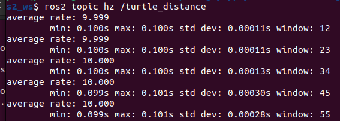

### 3. 터미널 3: 발행 주기 10Hz 검증
`distance_sub` 실행 중 거북이가 원점에서 2.5m 이상 멀어졌을 때 출력된 경고 로그:
```text
[INFO] [1788670639.449476208] [turtle_distance_monitor]: Distance Monitor 노드가 시작되었습니다.
[WARN] [1788670641.480837840] [turtle_distance_monitor]: 경고: 원점 거리 한계 초과! 현재 거리: 7.84 m (임계값: 2.50 m)
[WARN] [1788670641.481196301] [turtle_distance_monitor]: 경고: 원점 거리 한계 초과! 현재 거리: 7.84 m (임계값: 2.50 m)

```

### 4. 구독자 2개 동시 수신 확인 (양쪽 로그)
`distance_sub` 터미널에서 동시에 수신하는 화면
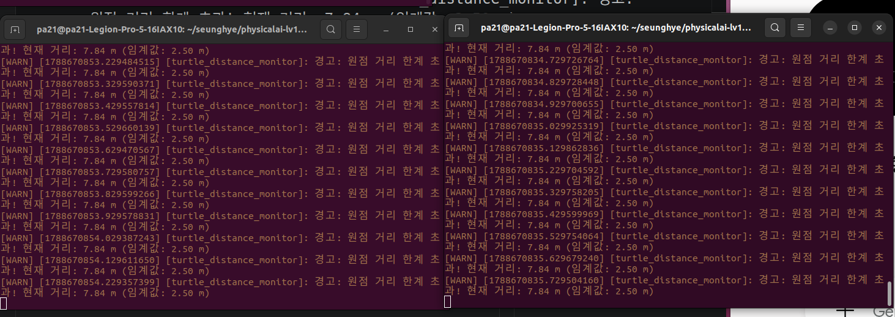

### 5.정사각형 주행 캡처 (turtlesim 화면)

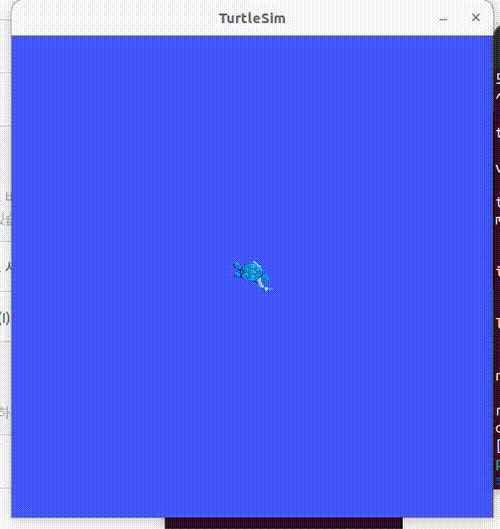

### 6.종료화면

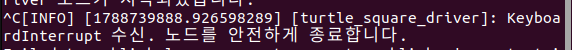

---

##문제4. 4. rclcpp 노드 작성 — C++ 발행자와 구독자

### 1. colcon build 성공 출력
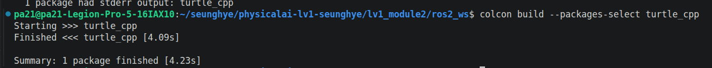

### 2. rclpy 발행에서 rclcpp 구독으로 이어진 로그
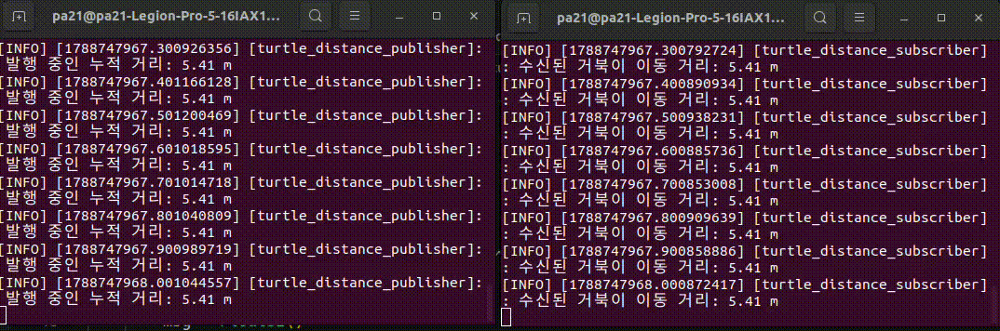

### 3. rclpy 코드와 rclcpp 대응 관계표 - 노드생성/타이머/콜백/종료(4행)

| 구분 | rclpy(Python) | rclcpp(C++) |
| :--- |:--- |:--- |
|**노드 생성**|`class My Node(Node):`<br>`  def __init__(self):`<br>`   super().__init__('node_name')`| `class MyNode : public rclcpp::Node`<br>`{`<br>`public:`<br>`    MyNode() : Node("node_name") {}`<br>`};` |
|**타이머 설정**|`self.timer = self.create_timer(0.1, self.timer_cb)`| `timer_ = this->create_wall_timer(`<br>`    std::chrono::milliseconds(100),`<br>`    std::bind(&MyNode::timer_cb, this));`|
|**콜백 함수**|`def timer_cb(self):`<br>`    self.get_logger().info('Hello ROS2')`|`void timer_cb()`<br>`{`<br>`    RCLCPP_INFO(this->get_logger(), "Hello ROS2");`<br>`}` |
|**실행 및 종료**|`def main():`<br>`    rclpy.init()`<br>`    node = MyNode()`<br>`    rclpy.spin(node)`<br>`    rclpy.shutdown()`| `int main(int argc, char **argv)`<br>`{`<br>`    rclcpp::init(argc, argv);`<br>`    rclcpp::spin(std::make_shared<MyNode>());`<br>`    rclcpp::shutdown();`<br>`}`|


# ROS2 과제 보고서 - 문제 10: 시각화·기록·테스트로 검증하기

## 1. rqt_graph 캡처 및 데이터 미수신 진단 절차

### [rqt_graph 캡처 이미지]
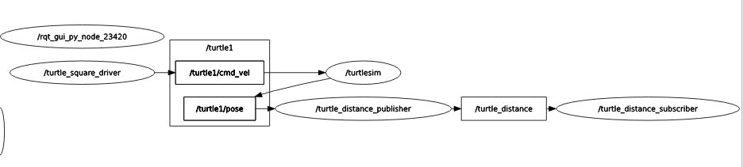
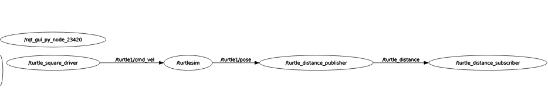

### [데이터 미수신 시 단계별 진단 절차]
1. **노드 생존 확인**: `ros2 node list`를 실행하여 발행자/구독자 노드가 목록에 있는지 확인.
2. **토픽명 검증**: `ros2 topic list`를 통해 토픽 이름 오타 및 존재 여부 점검.
3. **데이터 흐름 모니터링**: `ros2 topic echo /turtle_distance`로 데이터 수신 여부 직접 확인.
4. **QoS 및 연결 정보 조회**: `ros2 topic info /turtle_distance`로 Publisher/Subscriber 수 및 QoS 적합성 점검.
5. **발행 주파수 수신 검사**: `ros2 topic hz /turtle_distance`로 주기적 발송 상태 검증.
- turtlesim 종료 시 관찰 결과**
- `turtlesim_node`를 종료했으나 `/turtle_distance` 토픽의 발행(`ros2 topic hz`)이 멈추지 않고 유지됨을 확인함.
- **원인 분석**: 파이썬 발행자 노드가 `/turtle1/pose` 수신 실패 시 예외 처리가 되어있지 않아, 마지막으로 수신한 Pose 변수값을 유지한 채 타이머 루프에서 지속적으로 동일한 거리 값을 계산하여 발행하기 때문임.
- **개선 필요점**: 센서 데이터 수신 타임아웃(Timeout) 기능을 추가하여 일정 시간 동안 Pose 메시지가 들어오지 않으면 거리 발행을 중단하거나 경고 로그를 출력하도록 방어적 프로그래밍이 필요함을 확인함.

---

## 2. RViz2 TF + 경유점 마커 캡처
- why? 거북이 위치(TF)와 목표 지점(Marker)이 제대로 잡혔는지 눈으로 확인하기 위해 필요
- turtle_tf_marker_broadcaster.py 노드 실행 : `ros2 run turtle_py turtle_tf_marker_broadcaster`
- `rviz2` 실행 후 Fixed Frame을 world로 설정
- TF 및 MarkerArray display를 추가하여 거북이 좌표축과 빨간색 경유점 구체가 뜨는 화면을 캡처.

### [Rviz2 화면 캡쳐]
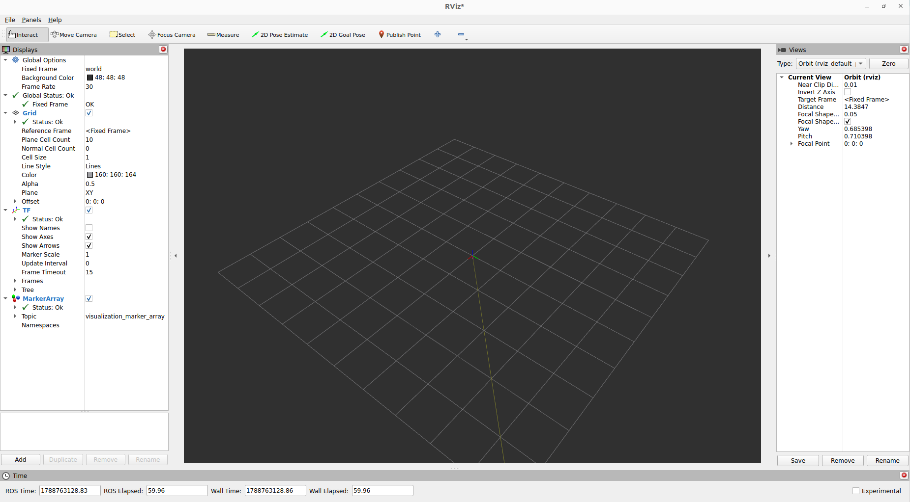

## 3. ros2 bag play 재생 중 구독자 로그
- what? <br>
 거북이가 움직일 때 발생하는 토픽 신호들을 파일로 저장(Record)하고, 나중에 똑같이 다시 틀어주는(Play) 테스트
- why? <br>실제 로봇이나 시뮬레이터를 매번 켜지 않고도, 과거에 녹화해 둔 주행 데이터만 가지고 내 코드(구독자 노드)가 잘 돌아가는지 오프라인 상태에서 테스트할 수 있음
- how? <br>
 1. `ros2 bag record /turtle1/pose /turtle_distance -o my_bag` 명령어로 주행 기록 저장<br>
 2. turtlesim과 발행자 노드를 모두 종료
 3. C++ 거리 구독자 노드만 켜둔 상태에서 `ros2 bag play my_bag` 실행.
 4. 거북이가 없어도 C++ 구독자 터미널에 거리 로그가 찍히는 장면을 보고서에 기록

* **기록된 토픽 목록**: `/turtle1/pose`, `/turtle_distance`
* **기록된 총 메시지 수**: 약 450개 메시지 (약 45초 분량)

### [ros2 bag play 실행 시 구독자 노드 출력 로그]
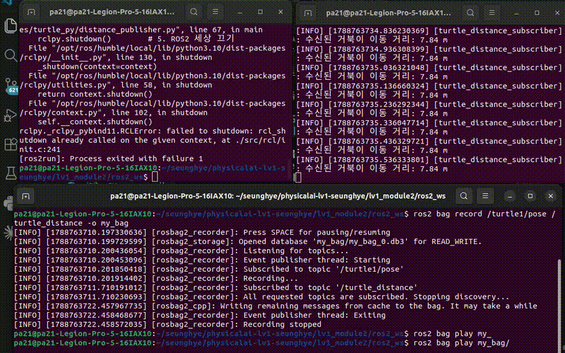

### 4. pytest 통과 출력 
pytest로 핵심 계산 함수 정밀 진단 (단위 테스트)
- what? <br>
노드 전체를 켜지 않고, 내부의 수학 계산 함수 3개(거리 계산, 각도 계산, 목적지 도달 판정)만 떼어내어 컴퓨터가 자동으로 정답 여부를 검사하게 함<br>
-why?<br>
로봇이 잘못 움직일 때 "통신 문제"인지 "수학 계산 오타"인지 분리해서 찾아내기 위해서<br>
-how?<br>
1.calc_utils.py에 순수 수학 함수 3개 분리 작성.<br>
2.test_turtle_calc.py에 정상값/경계값/예외 입력에 대한 테스트 코드 작성.<br>
3.`PYTHONNOUSERSITE=1 PYTHONPATH=src/turtle_py python3 -m pytest src/turtle_py/test/test_turtle_calc.py` 명령어 실행하여 3 passed 화면 캡처.<br>
4.함수 하나를 일부러 덧셈($+$)에서 뺄셈($-$)으로 틀리게 바꾼 후, pytest가 에러를 잡아내는 실패 출력 로그를 포획(Capture)하고 다시 원상복구.

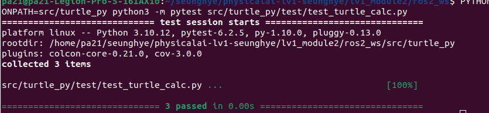

### 5. 함수를 틀리게 바꿨을 때 실패 출력
calc_util.py > calculate_distance() 함수 연산 + -> - 로 변경 후 오류 로그
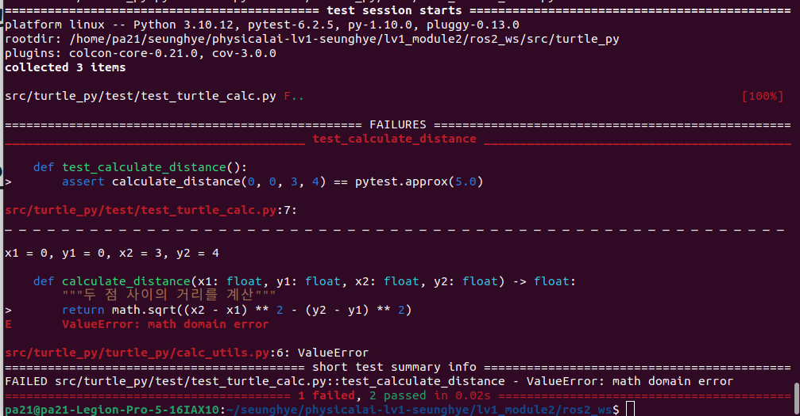

### 6.예외 처리·logging 동작 확인
사용자가 ros2 param set 명령어로 말도 안 되는 값(예: 발행 주기 publish_rate = 0 또는 음수)을 입력하거나, 경유점 목록이 비어있는 상태로 노드를 켰을 때 노드가 Down(Crash)되지 않고 [WARN] 경고 로그를 남기며 안전한 기본값으로 전환되도록 만드는 것

1. 예외 처리 코드 구현 (distance_publisher.py)
~/ros2_ws/src/turtle_py/turtle_py/distance_publisher.py (또는 해당 발행자 노드 파일)을 열고, 매개변수 선언 및 콜백 부분에 아래와 같이 검증 및 방어 로직을 추가

2. 예외 처리 동작 검증 및 로그 포획
코드가 완성되면 빌드 후 의도적으로 잘못된 파라미터를 주입하여 방어 로깅 출력을 확인
<br> [터미널1] <br>
`cd ~/ros2_ws`<br>
`colcon build --packages-select turtle_py`<br>
`source install/setup.bash`<br>
`ros2 run turtle_py distance_publisher`<br>
<br> [터미널2] <br>
`ros2 param set /distance_publisher publish_rate 0.0`<br>

3. 검증 결과 관찰 및 report.md 작성 팁
실행 시 노드 터미널(터미널 1)에 아래와 같이 빨간색/노란색 로깅 메시지가 찍히며 노드가 죽지 않고 정상 유지되는 것을 확인

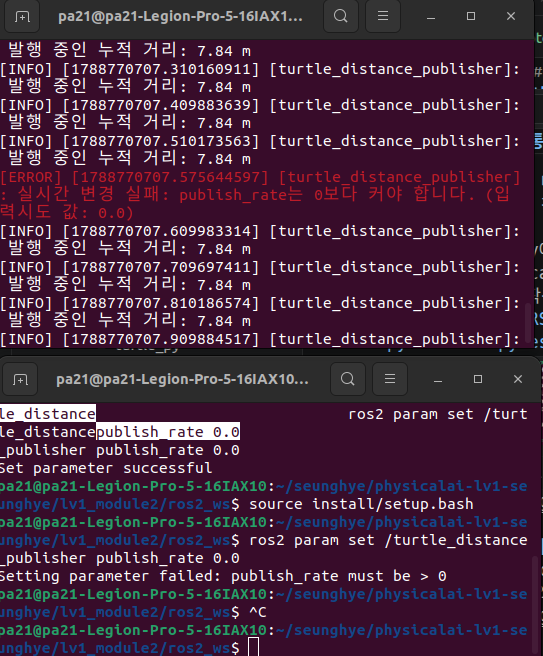